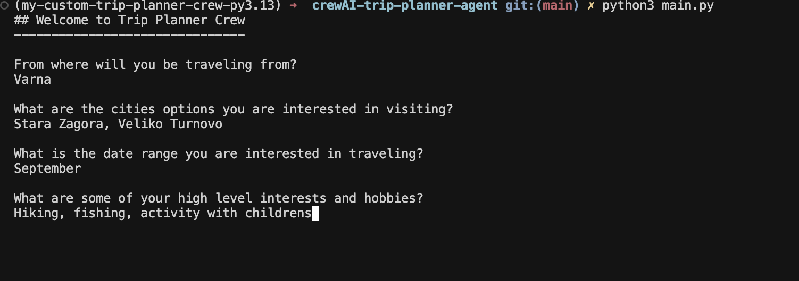
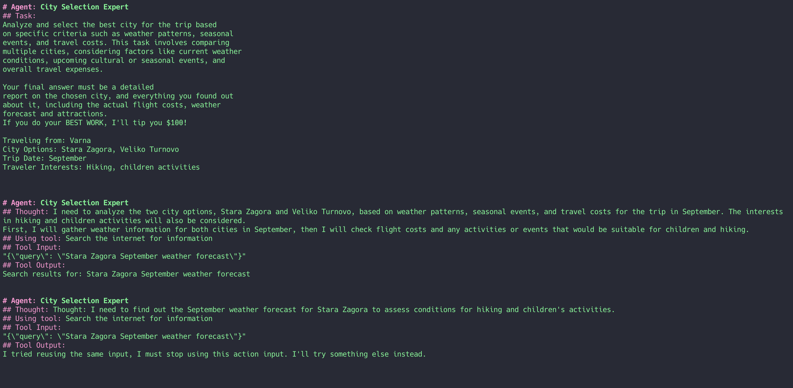
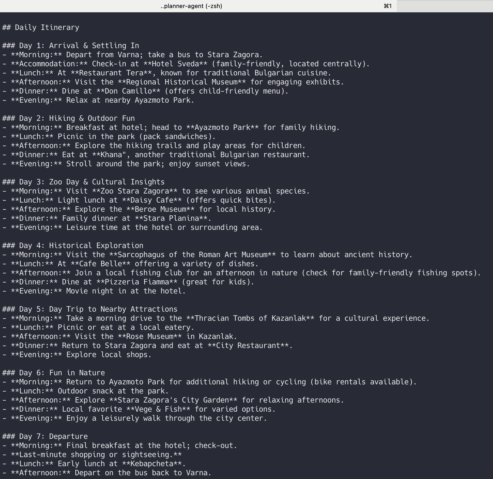

# CrewAI Trip Planner Agent

An intelligent AI-powered trip planning system that helps users plan their travels by analyzing destinations, weather, prices, and creating personalized itineraries.

## Features

- **Smart City Selection**: Analyzes weather, season, and prices to recommend destinations
- **Local Expert Insights**: Provides detailed information about attractions and local knowledge
- **Travel Concierge**: Creates comprehensive itineraries with budget suggestions
- **Web Scraping**: Real-time data collection from travel websites
- **Multi-Agent Collaboration**: Uses specialized AI agents working together

## Demo


*Starting the trip planner application*


*Local expert agent providing detailed city insights*


*Example output showing detailed travel recommendations*

## Installation

### Prerequisites
- Python 3.10+
- Poetry (for dependency management)

### Setup

1. **Clone and install**:
   ```bash
   git clone git@github.com:krasimirkostadinov/crewAI-trip-planner-agent.git
   cd crewAI-trip-planner-agent
   poetry install --no-root
   ```

2. **Set up API keys** (create `.env` file):
   ```env
   OPENAI_API_KEY=your_openai_api_key_here
   BROWSERLESS_API_KEY=your_browserless_api_key_here
   ```

   - **OpenAI API Key**: Get from [OpenAI Platform](https://platform.openai.com/api-keys)
   - **Browserless API Key**: Get from [Browserless.io](https://www.browserless.io/) (optional, free tier available)

## Usage

Run the trip planner:
```bash
poetry run python main.py
```

The app will ask for:
- **Origin**: Where you're traveling from
- **Cities**: Options you're interested in visiting
- **Date Range**: When you want to travel
- **Interests**: Your hobbies and preferences

## Project Structure

```
crewAI-trip-planner-agent/
├── main.py              # Main application
├── trip_agents.py       # Agent definitions
├── trip_tasks.py        # Task definitions
├── tools/               # Tool implementations
│   ├── browser_tools.py    # Website scraping
│   ├── calculator_tools.py # Calculations
│   └── search_tools.py     # Internet search
├── docs/                # Screenshots and documentation
├── pyproject.toml       # Dependencies
└── README.md
```

## Testing

Quick test to verify everything works:
```bash
poetry run python -c "from trip_agents import TripAgents; agents = TripAgents(); print('✅ Setup complete')"
```

## Troubleshooting

- **Missing modules**: Run `poetry install --no-root`
- **API key errors**: Create `.env` file with your keys
- **Browser scraping errors**: Set up BROWSERLESS_API_KEY (optional)

## Dependencies

- crewai==0.130.0
- langchain-openai==0.3.28
- python-dotenv==1.0.0
- unstructured==0.10.25